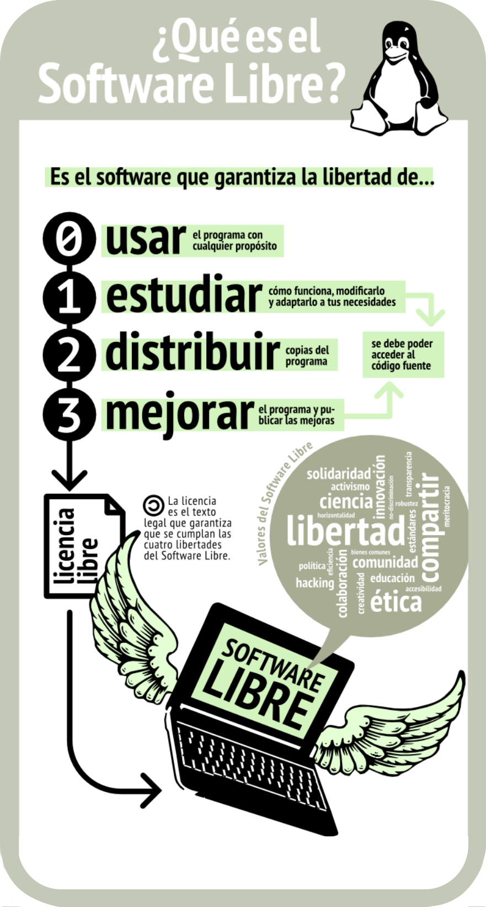
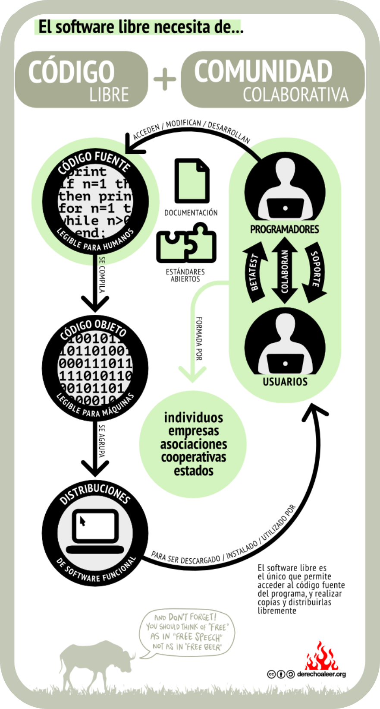
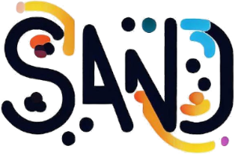
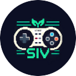
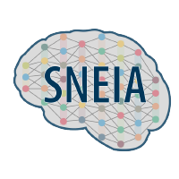

# FLISoL - Pereira 2024

¡Pereira repite FLISoL!, tras un genial año con más de 600 personas disfrutando del festival, este año la capital del Eje Cafetero se une nuevamente al Festival Latinoamericano de Instalación de Software Libre con la ayuda de la maravillosa Universidad Tecnológica de Pereira (UTP), con el apoyo de los semilleros del programa de ingeniería en sistemas y computación. Este año vamos por más talleres, más charlas y un evento más grande.

  

  <h2>Importancia del Código Libre y la Comunidad Colaborativa</h2>
  
  
La filosofía del FLISoL se centra en la promoción del uso y desarrollo de software libre, algo que no sería posible sin la colaboración continua de la comunidad. A continuación, se presentan dos diagramas que explican la interacción entre el código libre y la comunidad colaborativa, así como los principios fundamentales del software libre.

  

    
    
    
  

## Organizadores

  <h3 align="center">
    Andrés Manuel Prieto Álvarez
  </h3>

  

    
    
  

  <h3 align="center">
    José Felipe Duarte Colorado 
  </h3>

  

    
    
  

  <h3 align="center">
    Ana Sofía Beltran
  </h3>

  

    
    
  

### Grupo de investigación: Sirius

#### Líder

Doc. José A. Jaramillo Villegas

### Semillero: Backbone

  
  
  
  
  
  

#### Líderes

[Paula Andrea Castro](https://www.linkedin.com/in/paula-a-castro/) <[@paulacastro1](https://github.com/paulacastro1)> |
[Jhon Alex Gaviria](https://www.linkedin.com/in/jgaviria0/) <[@JGaviria0](https://github.com/JGaviria0)> |
[Sergio Daniel Estrella](https://www.linkedin.com/in/djkde/) <[@Djkde01](https://github.com/Djkde01)>

### Semillero: SONAR I.S.C

  
  
  

#### Líderes

[Juan Alejandro Pérez Bermudez](https://www.linkedin.com/in/mega-barto/) <[@Mega-Barto](https://github.com/Mega-Barto)> |
[Sebastián Agudelo Morales](https://www.linkedin.com/in/sebastian-agudelo-morales-367970241) |
[Diego Alejandro Cruz Bedoya](https://www.linkedin.com/in/dacb19)

### Semillero: SAND

  
  

#### Líderes

[Valentina Sanchez Mosquera](https://www.linkedin.com/in/valentina-sanchez-mosquera-a1b93a249/) |
[Esteban Escalante Cordoba](https://www.linkedin.com/in/estebanescor/) <[@Esca01](https://github.com/Esca01)> |
[Mateo Correa](mailto:m.correa3@utp.edu.co) <[@matt_co](https://www.instagram.com/matt__co/)>

### Semillero: SIV

  
  

#### Líderes

[Andres Felipe Rodas Rengifo](mailto:andres.rodas@utp.edu.co) |
[Cristhian Andres Grajales Perez](https://www.linkedin.com/in/cristhian-andres-grajales-perez/) |
[Tomas Marin Ariza](https://www.linkedin.com/in/tomas-marin-b73412268/)

### Semillero: SNEIA

