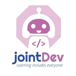

# FLISoL - Pereira 2023

La ciudad de Pereira, tras muchos años sin participar, se une nuevamente al festival FLISoL con la ayuda de la Universidad Tecnológica de Pereira (UTP), los semilleros del programa de ingeniería en sistemas y computación; renovando el enfoque al software libre, la creación de comunidad y la filosofía libre en el corredor natural de Colombia

  

## Organizadores

  <h3 align="center">
    Andrés Manuel Prieto Álvarez
  </h3>

  

    
    
  

  <h3 align="center">
    Cristhian Andrés Grajales Pérez 
  </h3>

  

    
    
  

  <h3 align="center">
    Daniela Ospina Salamanca
  </h3>

  

    
    
  

  <h3 align="center">
    Juan Jose Chaux Gallego
  </h3>

  

    
    
  

### Semillero: Backbone

  
  
  
  

#### Líderes

Paula Andrea Castro |
Jhon Alex Gaviria |
Nicole Rios |
Susana Perez |
Sergio Estrella

### Semillero: Joint Developer

  
  

#### Líderezas

María Susana Pérez |
Ángela mera |
Cindy Jiménez |
Ana Jiménez

### Semillero: SONAR I.S.C

  
  
  

#### Líderes

Juan Alejandro Pérez |
Sebastián Agudelo

### Semillero: SAND

  

#### Líderes

Valentina Sanchez Mosquera |
Esteban Escalante Cordoba

